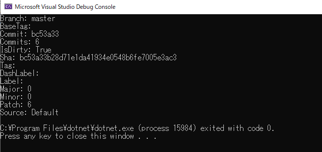

## Embbeded Version into assembly

There are many cases you want to use git versions to identify "which version is currently deployed?".

Let's see 3 way to accomplish this usecase.

### [Nerdbank.GitVersioning](https://github.com/AArnott/Nerdbank.GitVersioning)

Note: if you are using Git Shallow Clone, this library never works due to git-height comcept.

One of Major tool is Nerdbank.GitVersioning, this library will offer nuget library and .NET Global tools.

Both is possible, but if you just want to embedded git hash into assembly on the compile time, just use nuget library is enough.

CLI is more complex usecase, it can create git branch for each release and automatically commit it.

To access Version info, build at least onetime since nuget installed, then use `ThisAssembly`.

Here's sample.

Good point is, it embbeded gitversion into path version. Also it offers Build configuration.
Bad point is, it never work with git-shallow clone.

### [GitInfo](https://github.com/kzu/GitInfo/tree/master/src/GitInfo)

Other simple concept tool is GitInfo, this library will offer nuget library.

To access Version info, build at least onetime since nuget installed, then use `ThisAssembly`.

Here's sample.

Good point is, it simply embedded gitversion.
Bad point is, nothing. just simple enough.

### Self service

You can use sh or pwsh to ru script on compiletime, or indivisual script to generate versino json.

Then load version json as appsettings, and type map to `YourVersion` Class.

Now you can inject version with DI and useit anywhere.